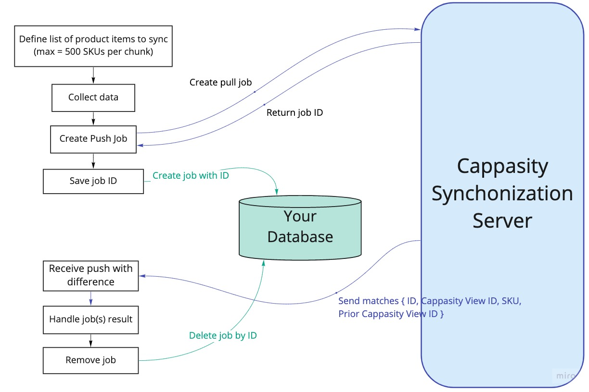
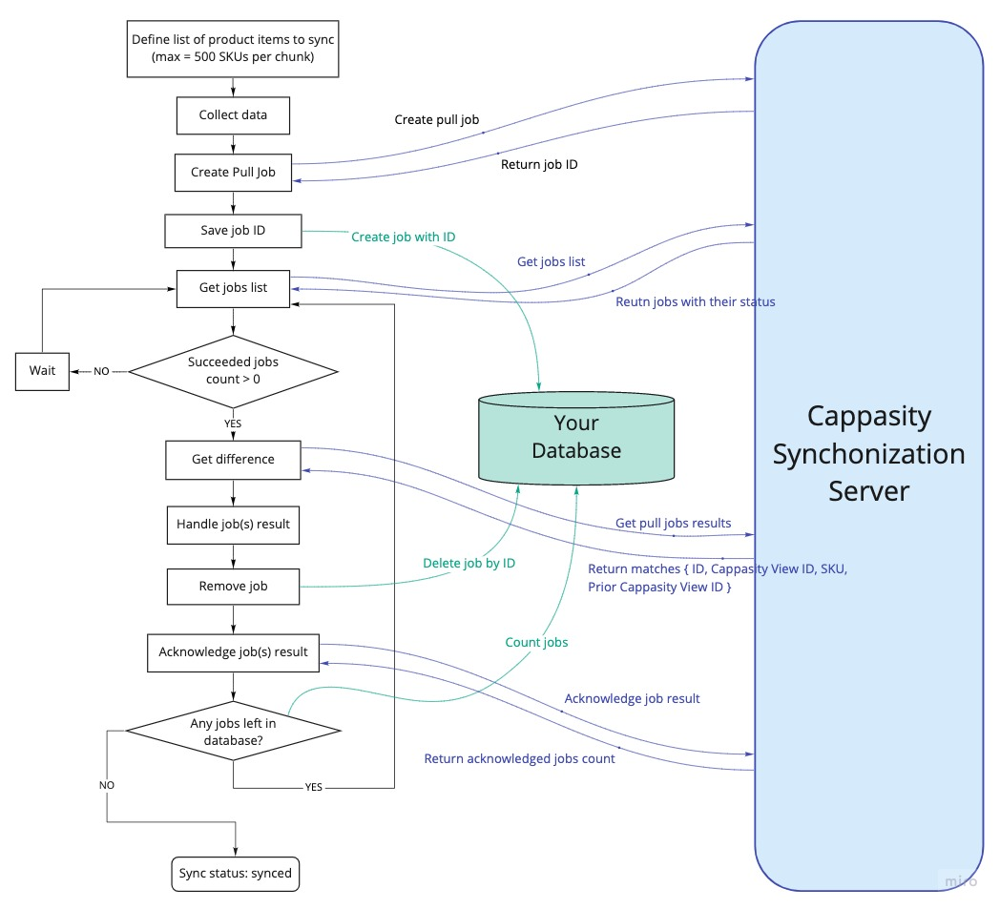
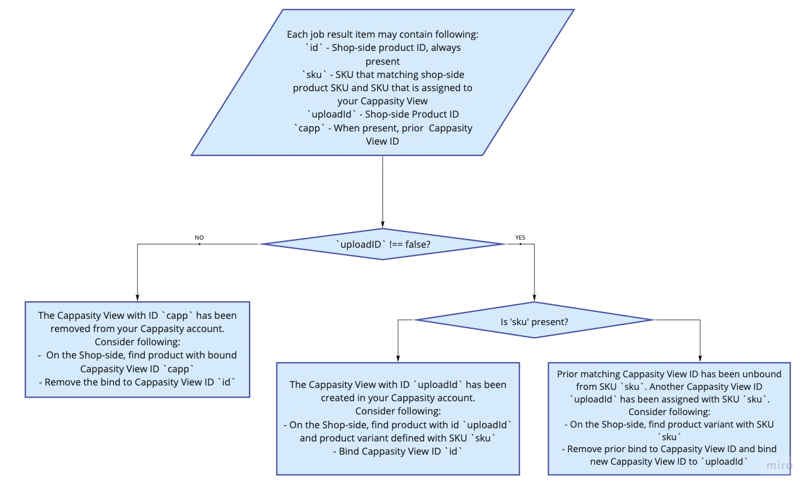

# Cappasity PHP SDK Integration Developer Guide

(c) Copyright 2019-2022, Cappasity Inc. All rights reserved.

## Table of Contents
- [Glossary](#glossary)
- [Prerequisites](#prerequisites)
  * [Create products on your online store](#create-products-on-your-online-store)
  * [Set up Cappasity account](#set-up-cappasity-account)
  * [Create Cappasity 3D View](#create-cappasity-3d-view)
  * [Generate API Token](#generate-api-token)
- [Integration](#integration)
  * [Match products and 3D Views](#match-products-and-3d-views)
    + [Collect data](#collect-data)
    + [HTTP Push flow](#http-push-flow)
      - [Register push.http type sync job](#register-pushhttp-type-sync-job)
      - [Handle result with callback](#handle-result-with-callback)
    + [HTTP Pull flow](#http-pull-flow)
      - [Register pull type sync job](#register-pull-type-sync-job)
      - [Get pull job result](#get-pull-job-result)
      - [Handle result](#handle-result)
      - [Acknowledge pull job result](#acknowledge-pull-job-result)
      - [Get pull job list](#get-pull-job-list)
  * [Refresh matches on demand](#refresh-matches-on-demand)
  * [Resynchronization](#resynchronization)
  * [Rate Limits](#rate-limits)
- [Render iFrame](#render-iframe)
- [Send Analytics](#send-analytics)

## About Cappasity
Cappasity is a SaaS solution that allows e-commerce businesses to create and display interactive 3D images on websites, mobile, and VR/AR apps to increase conversion and reduce product returns.

An online retailer creates 3D images of products using the Easy 3D ScanTM software and uploads them to the Cappasity platform account. Once integrated into the e-commerce website, the Cappasity PHP SDK synchronizes the retailer's catalog with the account based on matching SKU numbers. It enables the display of the required iFrame on the product page without its manual embedding for each product in the catalog.

## Glossary
* Store-side product catalogue
    * ID - unique product identifier
    * SKU - identification code that is applied to products. SKU code 
    often reveals product details such as color, size, manufacturer and brand.
* Cappasity Account with 3D Views
    * ID (example: `38020fdf-5e11-411c-9116-1610339d59cf`) - unique identifier of the Cappasity 3D View. We use it 
    internally to identify the 3D View. You need it to synchronize product catalogue  on your online store with the one 
    on our platform and render Cappasity Player via iFrame.
    * SKU - unique identifier assigned to your Cappasity 3D View. In order to be synchronized with your store-side
    product, it should match corresponding SKU of the product on your website.

## Prerequisites

### Create products on your online store
Each product you want to integrate has its inner ID on your store side and one or more corresponding SKU codes. 
Sometimes a product could also have variants with their own IDs and SKU numbers.

### Set up Cappasity account
Visit our website [cappasity.com](https://cappasity.com/) to download the Easy 3D Scan software, read instructions and 
create a 3D View yourself or to find Cappasity certified photo partner who will do this for you.

### Create Cappasity 3D View
Sign up at [3d.cappasity.com](https://3d.cappasity.com/register) to create and upload 3D Views. Fill in corresponding SKU 
identifier for those 3D Views that you want to synchronize. Each resulting model has its inner Cappasity View ID. You
need this IDs to generate an iFrame code for the player. 

### Generate API Token
Generate an API token on [security settings page](https://3d.cappasity.com/account/security) at your Cappasity account.

## Integration
You can generate the embed code by Cappasity View ID.
In order to get Cappasity View IDs you need to match your products SKUs with 3D Views. You can do it with our SDK.

### Match products and 3D Views
In general, to get the matches you should register a synchronization job via our SDK to have 3D images embedded into 
your website. As your product database could be huge, it could take some time to process it. Our server processes your 
request and stores the result. You should specify how you want to get the processing result: via push or 
pull. In the push case, you should also specify the callback URL on job registration. Once processing is done, 
our server sends the result to the specified callback URL. In the pull case, you should keep track of the job state and 
the results by yourself. When you get the result, you should store received matches for further usage.

#### Collect data
Let's say you have:
* Products on your store side:
    * Product with ID `111` without options with single SKU `SKU-111`
    * Product with ID `222` with options that have IDs `222a` and `222b`, product 
option `222a` has SKU `SKU-222-a` and product option `222b` has SKU `SKU-222-b`
    * Product with ID `333` with single SKU `SKU-333`
* 3D Views uploaded on Cappasity side:
    * View with ID `00000000-0000-0000-0000-000000000111` and SKU `SKU-111`
    * View with ID `00000000-0000-0000-0000-00000000222a` and SKU `SKU-222-a`
    * View with ID `00000000-0000-0000-0000-00000000222b` and SKU `SKU-222-b`
    * No corresponding view for product with SKU `SKU-333`   
    

Then collected items are:
```
$collectedItems = [
  [
    'id' => '111',
    'aliases' => ['SKU-111'],
  ],
  [
    'id' => '222',
    'aliases' => ['SKU-222-a'],
  ],
  [
    'id' => '222',
    'aliases' => ['SKU-222-b'],
  ],
  [
    'id' => '333',
    'aliases' => ['SKU-333'],
  ],
]
```
Notice that options IDs are not present. So you should be sure you can find back the product option ID by its SKU 
to handle the matches later.

Also consider [the synchronization limits](./flow.md#rate-limits).

#### HTTP Push flow



Collect data as described [above](#collect-data) and register a synchronization job.

##### Register push.http type sync job
[docs](./sdk.md#http-push-type)

```php
use CappasitySDK\Client\Model\Request;

$registerSyncJobId = $client
  ->registerSyncJob(Request\Process\JobsRegisterSyncPost::fromData(
    $collectedItems,
    'push.http',
    'http://your-callback-url.com/foo/bar
  ))
  ->getBodyData()
  ->getId(); // a9673347-8f2e-4caa-83e9-4139d7473c2f:A1
```
##### Handle result with callback
Your `/foo/bar` endpoint will receive a POST request with a body:
```
{
  "meta": {
    "jobId": "a9673347-8f2e-4caa-83e9-4139d7473c2f:A1",
    "jobType": "sync",
  },
  "data": {
    {
      "id": "111",
      "uploadId": "00000000-0000-0000-0000-000000000111",
      "sku": "SKU-111",
    },
    {
      "id": "222",
      "uploadId": "00000000-0000-0000-0000-00000000222a",
      "sku": "SKU-222-a",
    },
    {
      "id": "222",
      "uploadId": "00000000-0000-0000-0000-00000000222b",
      "sku": "SKU-222-b",
    },
    {
      "id": "333",
      "uploadId": false,
    }   
  }
}
```

After decoding it you can transform it to a helper model:
```php
use CappasitySDK\Client\Model\Callback\Process\JobsPushResultPost;

/** @var JobsPushResultPost\SyncDataItem[]|JobsPushResultPost $matches */
$matches = JobsPushResultPost::fromCallbackBody($requestBody);

foreach ($matches as $match) {
    // Handle sync item
}
```

#### HTTP Pull flow



Collect data as described [above](#collect-data) and register a synchronization job.

##### Register pull type sync job
[docs](./sdk.md#http-pull-type)
```php
use CappasitySDK\Client\Model\Request;

$registerSyncJobId = $client
  ->registerSyncJob(Request\Process\JobsRegisterSyncPost::fromData(
    $collectedItems,
    'pull'
  ))
  ->getBodyData()
  ->getId();
```

The results are stored for 24 hours or until the acknowledgement.

##### Get pull job list
To track all submitted jobs you can get a list of them, so you could get its IDs and statuses. Call the 
[getPullJobList()](./sdk.md#get-pull-job-list) method. Job lifecycle goes through three statuses: `queued`, `processing`
 and `success`. Once the job status is `success`, you should request the results.

##### Get pull job result
[getPullJobResult()](./sdk.md#get-pull-job-result) returns the result but does not erase it. You should implicitly 
acknowledge the result after you handle it successfully. If there is no result yet, then 404 will be returned.

##### Handle result
You can calculate the difference between current state and received results and update changed items. Make sure you store 
matched View IDs because you will need it [later.](./flow.md#refresh-matches-on-demand)

##### Acknowledge pull job result
[acknowledgePullJobList()](./sdk.md#acknowledge-pull-job-list) erases job results. You also can acknowledge multiple jobs
by IDs at the same time.

### Refresh matches on demand



Cappasity stores the matches of your inner product IDs and Cappasity View IDs in order to provide you only those items 
which have changed.

When your product database state changes – you have a new product, some product is updated, then you should collect 
relevant data scope and register the synchronization job again.
This time you should also provide previously matched Cappasity View IDs passing it as `capp` parameter value. If 
something has changed – 3D View has been deleted, another 3D View has been assigned to previously matched SKU, or a new 
one has been uploaded – the job will result in a diff.

Collected data example:
```
$collectedItems = [
  [
    'id' => '111',
    'aliases' => ['SKU-111'],
    'capp' => '00000000-0000-0000-0000-000000000111', 
  ],
  [
    'id' => '222',
    'aliases' => ['SKU-222-a'],
    'capp' => '00000000-0000-0000-0000-00000000222a',
  ],
  [
    'id' => '222',
    'aliases' => ['SKU-222-b'],
    'capp' => '00000000-0000-0000-0000-222bbb222bbb',
  ],
  [
    'id' => '333',
    'aliases' => ['SKU-333'],
  ],
]
```

Assuming that:
* View with ID `00000000-0000-0000-0000-000000000111` still has SKU `SKU-111`
* View with ID `00000000-0000-0000-0000-00000000222a` has been deleted
* New view with ID `00000000-0000-0000-0000-222bbb222bbb` has been created and has SKU `SKU-222-b`,
`00000000-0000-0000-0000-00000000222b` has no SKU
* New view with ID `00000000-0000-0000-0000-000000000333` has been created and has SKU `SKU-333`

Then if you receive results via the callback it will receive a POST request with a body:
```
{
  "meta": {
    "jobId": "a9673347-8f2e-4caa-83e9-4139d7473c2f:A1",
    "jobType": "sync",
  },
  "data": {
    {
      "id": "222",
      "uploadId": false,
      "sku": "SKU-222-a",
      "capp": "00000000-0000-0000-0000-00000000222a" // it means that in past `SKU-222-a` was assigned to View with this ID
    },
    {
      "id": "222",
      "uploadId": "00000000-0000-0000-0000-222bbb222bbb",
      "sku": "SKU-222-b",
    },
    {
      "id": "333",
      "uploadId": "00000000-0000-0000-0000-000000000333",
    }   
  }
}
```
Notice that there is no match for `SKU-111` because you get the diff only. What if you 
[still want to get it?](./flow.md#resynchronization)

### Resynchronization
In case you need to resynchronize your product database or a single item just don't send the `capp` IDs when you register
the synchronization job.

### Rate Limits

#### By sync items to register
Most likely, you are going to reach sync items rate limit.

##### Per job
* Maximum of 500 items

To register a bigger collection, split your items into several jobs.

##### Per all jobs for last 24 hours
* The maximum total number of items in all jobs registered for last 24 hours depends on your account plan, 10000 items at least.

Keep track of registered items not to overflow the limit and defer registering new jobs if needed, especially if you are used to operate with huge collections. For now, we don't provide current limit state and remaining items to sync. 
Consider retrying requests failed due to rate limit and use exponential backoff to reduce request count.

#### By requests

##### Per single IP
* Maximum of 1000 requests per 10 seconds

#### By connections

##### Per single IP
* Maximum of 60 new connections per 3 seconds
* Maximum of 30 active connections in total

Consider connection reuse.

## Render iFrame
Now you have all necessary Cappasity 3D View IDs.
Use them [to render an iFrame with `EmbedRenderer`](./sdk.md#render-embed-code) helper class.

## Send Analytics
Add the following script tag to the pages with Cappasity 3D Views:
```
<script async src=”https://api.cappasity.com/api/player/cappasity-ai” />
```
It will collect and send Cappasity 3D View analytics.
